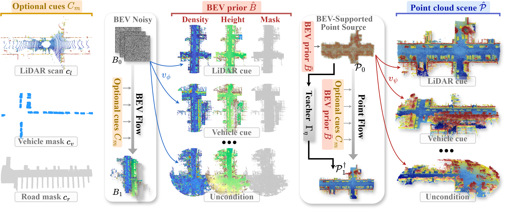

# FPSGen

<p align="center">
  
</p>

<p align="center">
  <a href="https://arxiv.org/abs/2607.26645">
    
  </a>
  
  
  
  
</p>

<p align="center">
  <a href="https://arxiv.org/abs/2607.26645"><strong>📄 Paper</strong></a>
  &nbsp;•&nbsp;
  <a href="docs/INSTALL.md"><strong>🛠 Installation</strong></a>
  &nbsp;•&nbsp;
  <a href="docs/DATASET.md"><strong>🗂 Dataset</strong></a>
  &nbsp;•&nbsp;
  <a href="docs/METHOD.md"><strong>🧠 Method</strong></a>
  &nbsp;•&nbsp;
  <a href="docs/EVALUATION.md"><strong>📊 Evaluation</strong></a>
  &nbsp;•&nbsp;
  <a href="docs/REPRODUCIBILITY.md"><strong>🔁 Reproducibility</strong></a>
</p>

<p align="center">
  Official implementation of<br>
  <strong>FPSGen: Flexible Point Cloud Scene Generation with BEV-Supported Transport Flows</strong>
</p>

FPSGen is a flexible point-cloud scene generation framework that supports different combinations of LiDAR, vehicle, and road conditions through BEV-supported transport flows.

The repository includes the complete three-stage training pipeline, unified inference, evaluation utilities, dataset loaders, configuration templates, and pretrained checkpoint links.

Datasets, checkpoints, experiment logs, generated point clouds, and machine-specific paths are not committed to this repository.

## ✨ Highlights

- **Flexible condition generation:** supports all eight LiDAR, vehicle, and road condition tuples.
- **BEV-supported structural prior:** models density, maximum height, and occupancy before point-level generation.
- **Three-stage learning pipeline:** consists of BEV Flow, Teacher Transport, and Student Point Flow.
- **Approximate-OT transport:** learns a direct point-flow trajectory between source and clean endpoint distributions.
- **Reproducible implementation:** provides full-training configurations, smoke tests, evaluation scripts, and pretrained checkpoints.

## 🧠 Method Overview

FPSGen decomposes large-scale point-cloud generation into three stages:

1. **Flexible Condition BEV Flow Prior.** A conditional velocity field generates the structural prior $B=[D,H,M]$, comprising normalized density, maximum height, and occupancy.

2. **Teacher Transport Mapping.** A teacher learns a source-indexed clean endpoint $\mathcal{P}_1^\dagger$ from an independently BEV-sampled source $\mathcal{P}_0$.

3. **Approximate-OT Point Flow.** A student learns the straight transport velocity from $\mathcal{P}_0$ to $\mathcal{P}_1^\dagger$, conditioned on the generated BEV prior and the active condition tuple.

During inference, BEV Flow and Point Flow are integrated sequentially using classifier-free guidance and forward Euler updates.

See [`docs/METHOD.md`](docs/METHOD.md) for notation, tensor conventions, and method-to-code correspondence.

## 🛠 Installation

### Environment

| Dependency | Version |
| --- | --- |
| Python | 3.9 |
| PyTorch | 1.13.0 |
| CUDA | 11.7 |
| MinkowskiEngine | 0.5.4 |

Follow [`docs/INSTALL.md`](docs/INSTALL.md) to install PyTorch, MinkowskiEngine, Python dependencies, and the required CUDA extensions.

### Chamfer Distance

Build the required Chamfer distance extension:

```bash
pip install -e fpsgen/models/ChamferDistancePytorch/chamfer3D
```

Verify the environment and CUDA operator:

```bash
CUDA_VISIBLE_DEVICES=0 python scripts/check_environment.py
CUDA_VISIBLE_DEVICES=0 python scripts/verify_cuda_ops.py
```

## 🗂 Dataset Preparation

FPSGen uses SemanticKITTI/KITTI-Odometry sequences with calibration files, poses, raw LiDAR scans, and preprocessed point-cloud arrays.

A prepared sequence follows this structure:

```text
KITTI_Odometry/
└── 00/
    ├── calib.txt
    ├── poses.txt
    ├── map_clean.npy
    ├── velodyne/
    ├── input_/
    └── gt_/
```

Set the dataset root:

```bash
export TRAIN_DATABASE=/path/to/KITTI_Odometry
```

Run the data-preparation scripts:

```bash
python scripts/aggregate_semantickitti_map.py \
  --data-root /path/to/KITTI_Odometry \
  --sequences 00

python scripts/prepare_semantickitti.py \
  --data-root /path/to/KITTI_Odometry \
  --sequences 00 --split train
```

See [`docs/DATASET.md`](docs/DATASET.md) for the full preprocessing workflow.

## 🚂 Training

Run the three stages in order:

| Stage | Component | Default Epochs | Batch Size | Configuration |
| :---: | --- | :---: | :---: | --- |
| 1 | BEV Flow | 500 | 8 | `configs/train_bev.yaml` |
| 2 | Teacher Transport | 5 | 2 | `configs/train_teacher.yaml` |
| 3 | Student Point Flow | 10 | 2 | `configs/train_student.yaml` |

```bash
python -m fpsgen.train_bev \
  --config configs/train_bev.yaml

python -m fpsgen.train_teacher \
  --config configs/train_teacher.yaml

python -m fpsgen.train_student \
  --config configs/train_student.yaml
```

Before Stage 3, set `train.teacher_checkpoint` in `configs/train_student.yaml` to the Stage-2 checkpoint.

Use `--checkpoint` to resume training:

```bash
python -m fpsgen.train_student \
  --config configs/train_student.yaml \
  --checkpoint /path/to/model.ckpt
```

Lightweight one-batch, one-epoch configurations are provided for pipeline validation:

```text
configs/smoke_bev.yaml
configs/smoke_teacher.yaml
configs/smoke_student.yaml
```

## 🔍 Inference

Set the Stage-1 BEV Flow checkpoint:

```bash
export FPSGEN_BEV_CHECKPOINT=/path/to/bev.ckpt
```

Run inference with the Stage-3 Student checkpoint:

```bash
python -m fpsgen.inference \
  --diff /path/to/student.ckpt \
  --refine ""
```

For a quick end-to-end test:

```bash
CUDA_VISIBLE_DEVICES=0 python scripts/smoke_inference.py \
  --input /path/to/KITTI_Odometry/00/input_/000000.npy \
  --bev /path/to/smoke_bev.ckpt \
  --student /path/to/smoke_student.ckpt
```

## 📊 Evaluation

### Completion Evaluation

Run the completion evaluation script:

```bash
export FPSGEN_OUTPUT_DIR=outputs/seq08_completion

PYTHONPATH="$PWD/fpsgen/models/ChamferDistancePytorch:$PYTHONPATH" \
python -m fpsgen.utils.eval_path_multirange \
  --diff /path/to/student.ckpt \
  --path /path/to/KITTI_Odometry \
  --dataset SemanticKITTI \
  --sequences 08 \
  --img-steps 10 \
  --point-steps 1 \
  --cond-weight 2 \
  --cond-mode 100 \
  --select-mode frame \
  --interval-frames 100 \
  --no-save-pcd \
  --save-ply
```

### Generation Evaluation

Run the generation evaluation script:

```bash
export FPSGEN_BEV_CHECKPOINT=/path/to/bev.ckpt

PYTHONPATH="$PWD/fpsgen/models/ChamferDistancePytorch:$PYTHONPATH" \
python -m fpsgen.utils.eval_generation \
  --diff /path/to/student.ckpt \
  --path /path/to/KITTI_Odometry \
  --dataset SemanticKITTI \
  --sequences 08
```

See [`docs/EVALUATION.md`](docs/EVALUATION.md) for supported datasets, metrics,
and command-line arguments.

## 🎛 Eight-Condition Generation

Generate samples for all eight LiDAR, vehicle, and road condition tuples:

```bash
CUDA_VISIBLE_DEVICES=0 python scripts/generate_eight_conditions.py \
  --input /path/to/KITTI_Odometry/00/input_/000000.npy \
  --bev /path/to/bev.ckpt \
  --student /path/to/student.ckpt \
  --output outputs/eight_conditions/000000
```

The script writes PLY files and a `manifest.json` containing the condition tuples, random seeds, and inference settings.

Use `--output-format pcd` when PCD output is required.

## 📦 Pretrained Checkpoints

Download the released checkpoints and place them under `checkpoints/` with the filenames shown below.

| Stage | Component | Filename | Download |
| :---: | --- | --- | :---: |
| 1 | BEV Flow | `bevflow_gen_img_epoch=499.ckpt` | [Google Drive](https://drive.google.com/file/d/1HzV4bU40-WPxYNO1tnRh9FkJws32-r2w/view?usp=drive_link) |
| 2 | Teacher Transport | `teacher_gen_stg1_bev_epoch=04.ckpt` | [Google Drive](https://drive.google.com/file/d/1w6MBUeFB1xRRt1-Mano9Wrwt2EQ_--oN/view?usp=drive_link) |
| 3 | Student Point Flow | `student_gen_stg2_epoch=09.ckpt` | [Google Drive](https://drive.google.com/file/d/1SiB71t2bHnEMUkg6QSuCUrkgeHaPdPY5/view?usp=drive_link) |

Recommended layout:

```text
checkpoints/
├── bevflow_gen_img_epoch=499.ckpt
├── teacher_gen_stg1_bev_epoch=04.ckpt
└── student_gen_stg2_epoch=09.ckpt
```

Use the checkpoints as follows:

- BEV Flow: set through `FPSGEN_BEV_CHECKPOINT`.
- Teacher Transport: used when reproducing Stage-3 training.
- Student Point Flow: passed to `--diff` during inference and evaluation.

## 🧱 Repository Layout

```text
fpsgen/                 Models, datasets, training, inference, and metrics
configs/                Full-training and smoke-test configurations
scripts/                Preprocessing, environment checks, and utilities
docs/                   Installation, method, dataset, and evaluation guides
third_party/licenses/   Third-party licenses and notices
```

Local artifacts are written to:

```text
checkpoints/
experiments/
outputs/
```

## 📚 Documentation

| Document | Description |
| --- | --- |
| [`docs/INSTALL.md`](docs/INSTALL.md) | Environment and CUDA-extension installation |
| [`docs/DATASET.md`](docs/DATASET.md) | Dataset structure and preprocessing |
| [`docs/METHOD.md`](docs/METHOD.md) | Method notation and code correspondence |
| [`docs/EVALUATION.md`](docs/EVALUATION.md) | Evaluation protocols and metrics |
| [`docs/REPRODUCIBILITY.md`](docs/REPRODUCIBILITY.md) | From-scratch reproduction workflow |
| [`docs/PUBLISHING.md`](docs/PUBLISHING.md) | Source-release checklist |

## 🙏 Acknowledgements

We gratefully acknowledge the authors of [**LiDiff**](https://github.com/PRBonn/LiDiff), [**LiDPM**](https://github.com/astra-vision/LiDPM), [**ScoreLiDAR**](https://github.com/happyw1nd/ScoreLiDAR), [**Distillation-DPO**](https://github.com/happyw1nd/DistillationDPO), and [**LiFlow**](https://github.com/matteandre/LiFlow) for their open research contributions, which inspired and informed this project.

FPSGen also uses the CUDA Chamfer distance implementation from [**ChamferDistancePytorch**](https://github.com/ThibaultGROUEIX/ChamferDistancePytorch), distributed under the MIT License.

## 📝 Citation

If you find FPSGen useful in your research, please consider citing:

```bibtex
@misc{he2026fpsgen,
  title         = {FPSGen: Flexible Point Cloud Scene Generation with BEV-Supported Transport Flows},
  author        = {Wenzhe He and Meng Wang and JiaWei Qian and Jinfeng Xu and Ying Liu and Ruihui Li},
  year          = {2026},
  eprint        = {2607.26645},
  archivePrefix = {arXiv},
  primaryClass  = {cs.CV},
  url           = {https://arxiv.org/abs/2607.26645}
}
```
